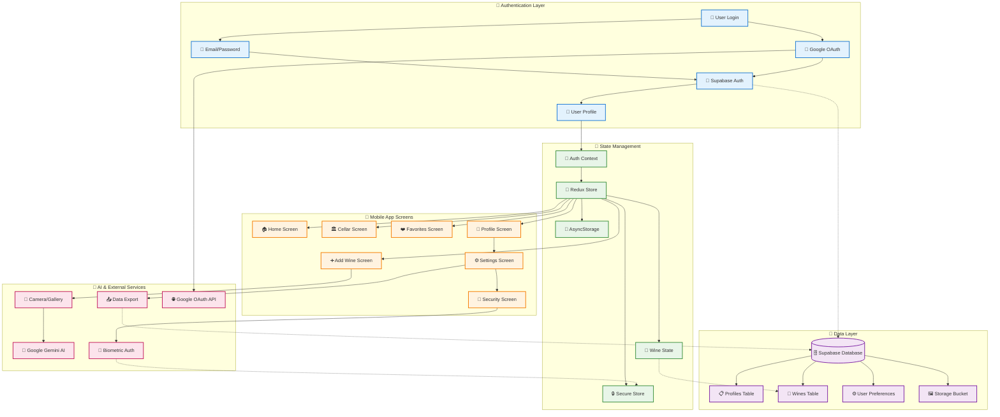
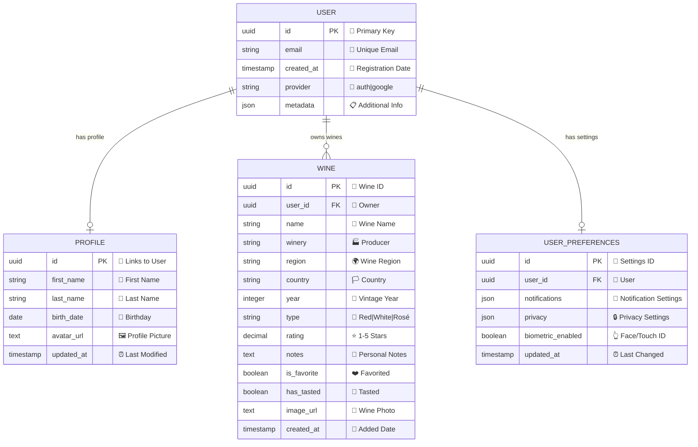

# 🍷 WinAI Mobile App - Architecture Documentation

## 📊 System Overview

WinAI is a React Native mobile application for wine enthusiasts, built with Expo, featuring AI-powered wine analysis, biometric authentication, and comprehensive wine collection management.

## 🏗️ Architecture Diagrams

### System Architecture


### Database Schema


## 🔧 Technology Stack

### Frontend
- **Framework:** React Native with Expo
- **Navigation:** Expo Router
- **State Management:** Redux Toolkit
- **Authentication:** Supabase Auth + Google OAuth
- **UI Components:** Custom components with Wine theme
- **Animations:** React Native Reanimated

### Backend & Services
- **Database:** Supabase (PostgreSQL)
- **Storage:** Supabase Storage
- **AI Analysis:** Google Gemini API
- **Authentication:** Supabase Auth
- **Biometrics:** Expo Local Authentication

### Key Features
- 🍷 Wine collection management
- 📸 AI-powered wine analysis from photos
- 🔐 Biometric authentication (Face ID/Touch ID)
- 👤 User profile management
- 📤 Data export functionality
- 🌙 Dark/Light theme support
- 📱 Cross-platform (iOS/Android)

## 📱 Screen Structure

```
app/
├── (tabs)/                 # Main tab navigation
│   ├── index.tsx          # 🏠 Home screen
│   ├── add-wine.tsx       # ➕ Add wine screen
│   ├── cellar.tsx         # 🏛️ Wine cellar
│   ├── favorites.tsx      # ❤️ Favorites
│   └── profile.tsx        # 👤 Profile
├── auth/                  # Authentication screens
│   ├── login.tsx          # 🔐 Login
│   ├── register.tsx       # 📝 Registration
│   └── ...
├── edit-profile.tsx       # ✏️ Edit profile
├── security.tsx           # 🔒 Security settings
└── change-password.tsx    # 🔑 Password change
```

## 🔄 Data Flow

1. **Authentication:** User logs in → Supabase Auth → Profile loaded → Redux updated
2. **Wine Management:** Add wine → AI analysis → Form pre-fill → Save to Redux
3. **Biometric Auth:** Setup → Device check → Secure store → Login enhancement
4. **Data Export:** Collect data → Generate JSON → File system → Share

## 🚀 Getting Started

1. Install dependencies: `npm install`
2. Set up environment variables
3. Configure Supabase project
4. Run: `npx expo start`

## 📚 Additional Resources

- [Expo Documentation](https://docs.expo.dev/)
- [Supabase Documentation](https://supabase.com/docs)
- [React Native Documentation](https://reactnative.dev/) 